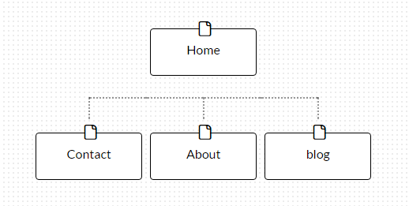

**What are the 6 Phases of Web Design?**
The 6 basic phases to the process of Web Design are

**Information Gathering.**

Decide the purpose, goals, target audience and content of your site. This will make organizing the site easier and give you an idea of how to structure the site based off why you're creating it.

**Planning.**

Planning is done by creating a site map, it will help you decide what to keep, change and delete to make it easy for the end user to navigate.

**Design**

Now that you know what your site needs to contain, its time to put everything together for show. Using a site mockup or wireframe is a great way to prototype ideas. They allow you to set placeholders for the content you will put in.

**Development.**

After you have an idea of what you'd like the site to look like. You can start writing code to bring the website to life. 

**Testing and Delivery.**

This is where the developer makes sure the site works and launches it. Things such as cross browser compatability, forms and scripts are checked over so consumers wont run into any hicups once the site is live. 

**Maintenance**

Your site wont look the way it does forever. Your employer will most likely want new content featured regularly so updating it is neccissary.

**What is your site's primary goal or purpose? What kind of content will your site feature?**

My sites goal is to give potential employers an idea of who I am. My site will feature contact information to let employers or other developers looking to collaborate easily get intouch with me. It will feature my work such as projects I've worked on that are now live as well as my github profile. Most importantly, I want my site to be a portfolio it's self, I want users to be intrigued by what I'm able to create without having to vist external sources such as github.

**What is your target audience's interests and how do you see your site addressing them?**

My target audience is people who need web apps to make their lives easier. Business owners who are looking for automated checkout and currency conversion as well as user authentication so every order is fufilled at ease. Other than clients I'd be interested in working with other developers on fun ideas that dont involve money.

**What is the primary "action" the user should take when coming to your site? Do you want them to search for information, contact you, or see your portfolio? It's ok to have several actions at once, or different actions for different kinds of visitors.**

The primary action of the user is to find information about me that's allready organized for them. Through exploring my site, users should easily find out what makes my work original and the benefits of working with me. They should take time to play with the features my site will contain.

**What are the main things someone should know about design and user experience?**

It's important to have good taste, referance others work and trust your eye.

**What is user experience design and why is it valuable?** 

User experiance is valuble because it's the reason why your site will recive traffic. Not all people have experiance with the internet so its important to make sites that are easy to use and navigate for everyone.

**Which parts of the challenge did you find tedious?**

I find information gathering and making site maps tedious because it feels like it takes more time than it should to choose, relate and take away features that your site will contain. I like to jump into developing but I quickly realized that design makes the coding process smoother.

