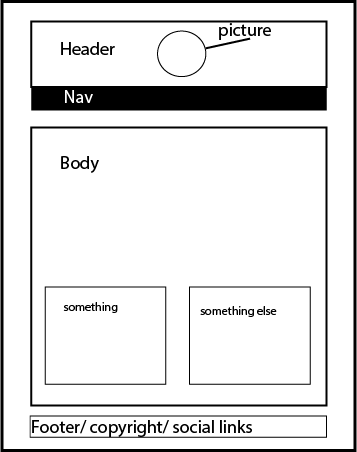

**What is a wireframe?**

A wireframe is a mock up of a website. It's an illustration of the way you want the website to look so you have an idea of what your going to code.

**What are the benefits of wireframing?**

A wireframe will give you faster workflow because you wont be blindly coding. With a wireframe you can make decisions about looks early on and with a program like Illustrator you can export .css elements and exact color codes of the design to implement when coding.

**Did you enjoy wireframing your site?**

Yes, I got a general look of what I want and I was able to choose a different spot for the navigation bar without coding. 

**Did you revise your wireframe or stick with your first idea?

I revised my wireframe. I changed the location of the nav bar by moving shapes around.

**What questions did you ask during this challenge? What resources did you find to help you answer them?**

What would make the page easy to navigate through if I was another student. I looked at different blogs and blog posts to figure out something that would work.

**Which parts of the challenge did you enjoy and which parts did you find tedious?**

I found wireframing both the most enjoyable and tedious. I liked choosing the elements I decided on but creating the wireframe in Illustrator took longer than it should have because I'm not too familiar with the program. I'm currently checking out Treehouse's course on Adobe Illustrator to get better at it.